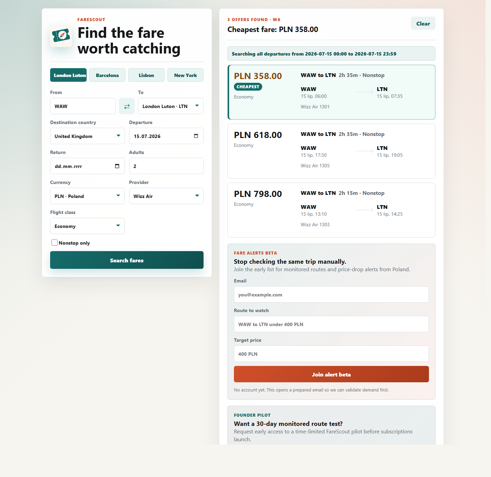

# FareScout

[](https://github.com/Desdem0n/farescout/actions/workflows/check.yml)

FareScout is a responsive full-stack flight fare finder that searches live fares through the Ignav API, compares results across a full departure day, and highlights the cheapest returned offer without hiding the rest.

Live demo: [https://farescout.onrender.com](https://farescout.onrender.com)

I built it as a portfolio-ready product slice: mobile-first UI, lightweight Node backend, secure API-key handling, real third-party API integration, defensive validation, and product documentation that explains where the MVP can grow next.



## Recruiter Snapshot

- Built a live API-backed search app from a blank repo to public GitHub-ready MVP.
- Designed the backend as a secure proxy so the API key never reaches the browser.
- Normalized third-party flight data into a predictable UI contract.
- Added filters for airport, country, provider, cabin class, market/currency, passengers, and nonstop preference.
- Documented product requirements, testing, deployment, and SaaS roadmap.
- Kept the runtime dependency-free so the project is easy to inspect and run.

## Features

- Live fare search through the Ignav API.
- Global-friendly airport search with country-based origin and destination selection, with Warsaw as the default demo origin.
- Support for high-interest international and United States domestic routes through airport selection.
- Airport search by real three-letter IATA airport codes.
- Full-day departure search, displayed as `00:00` through `23:59`.
- Currency selection through Ignav market codes such as `PL`, `GB`, and `US`.
- Airline/provider filtering, including Wizz Air, LOT, Ryanair, British Airways, Lufthansa, KLM, Air France, TAP, Iberia, Southwest, JetBlue, Alaska, Spirit, Frontier, and major US carriers.
- Flight class selection: economy, premium economy, business, and first.
- Advanced filters keep currency, provider, cabin class, and nonstop controls available without crowding the first screen.
- Clear cheapest-fare highlight without hiding other returned prices.
- Search-result CTA that turns a fare search into a prefilled route-alert beta request.
- Backend lead relay for beta waitlist and founder pilot requests, with safe email fallback when the private webhook is not configured.
- Share-ready promo reel page at `/promo.html` for short launch videos.
- Mobile-first responsive layout.
- Dependency-free runtime: only Node built-ins are used.

## Tech Stack

- Frontend: HTML, CSS, vanilla JavaScript
- Backend: Node.js HTTP server
- API: Ignav flight fares API
- Configuration: `.env` file loaded server-side
- Deployment-ready: Render blueprint through `render.yaml`

## Architecture

```text
Browser UI
  -> local Node backend
    -> Ignav API
      -> normalized fare results
        -> responsive results UI
```

The API key stays on the backend and is never sent to the browser.

## Setup

1. Create an Ignav account from [ignav.com](https://ignav.com/).
2. Copy your API key from the Ignav dashboard.
3. Copy `.env.example` to `.env`.
4. Fill in `IGNAV_API_KEY`.

```env
IGNAV_API_KEY=your_ignav_api_key
IGNAV_BASE_URL=https://ignav.com/api
PORT=4000
FARESCOUT_LEADS_WEBHOOK_URL=
FARESCOUT_LEADS_WEBHOOK_TOKEN=
```

## Run

```bash
node server.js
```

Then open:

```text
http://localhost:4000
```

## Verify

```bash
npm run check
```

Run browser-level product flow tests:

```bash
npm install
npx playwright install chromium
npm run test:e2e
```

If `npm` is unavailable, run the syntax checks directly:

```bash
node --check server.js
node --check public/app.js
```

## Project Docs

- [Case Study](./docs/CASE_STUDY.md)
- [Product Requirements](./PRD.md)
- [Testing Checklist](./TESTING.md)
- [Deployment Notes](./DEPLOYMENT.md)
- [Roadmap](./ROADMAP.md)
- [SaaS Plan](./SAAS_PLAN.md)
- [SaaS Migration Blueprint](./docs/SAAS_MIGRATION_BLUEPRINT.md)
- [Growth Skills Playbook](./docs/GROWTH_SKILLS_PLAYBOOK.md)
- [Paid Pilot Plan](./PILOT_SALES.md)
- [Commercialization Boundary](./COMMERCIALIZATION.md)
- [Global Launch Playbook](./docs/GLOBAL_LAUNCH.md)
- [Social Launch Kit](./docs/SOCIAL_LAUNCH_KIT.md)
- [7-Day Promotion Campaign](./docs/FARESCOUT_7_DAY_CAMPAIGN.md)
- [Campaign Tracking Log](./docs/CAMPAIGN_TRACKING.md)
- [GitHub Repository Setup](./docs/GITHUB_REPO_SETUP.md)
- [Post-Deploy Launch Checklist](./docs/POST_DEPLOY_LAUNCH.md)
- [GitHub Profile README Draft](./docs/GITHUB_PROFILE_README.md)

## API Notes

- Ignav expects airport codes, not city codes. Use `LHR`, `LTN`, or `STN` instead of `LON`.
- Currency is selected through Ignav's `market` parameter. For example, `PL` returns Polish-market fares in PLN.
- Provider filtering uses Ignav's `airlines_include` parameter, then the backend recalculates the cheapest returned fare.
- The backend sends a local departure-time range from hour `0` through hour `23`, and the UI presents that as a full-day search from `00:00` to `23:59`.
- `POST /api/public/waitlist` and `POST /api/public/pilot` relay beta/pilot interest to `FARESCOUT_LEADS_WEBHOOK_URL` when configured, without exposing the private destination to the browser.

## What This Project Demonstrates

- Secure API proxy design.
- Third-party API integration and response normalization.
- Defensive validation and human-readable error handling.
- Mobile-first product UI.
- Filtering, sorting, and cheapest-result highlighting.
- Employer-friendly documentation and product thinking.
- CI-friendly project structure with a simple automated syntax check.

## License And Use

FareScout is public for portfolio review and technical evaluation, but it is not open-source software.

The code, name, logo, product concept, and documentation are reserved. Commercial use, redistribution, resale, or hosted copies require prior written permission.

See [LICENSE](./LICENSE) and [SECURITY](./SECURITY.md).

Commercial SaaS logic should live in a private backend. See [COMMERCIALIZATION](./COMMERCIALIZATION.md).

## Roadmap

- Deploy a public demo.
- Add saved searches.
- Add price-drop alerts.
- Add historical price tracking.
- Add authentication and subscriptions for a SaaS version.
